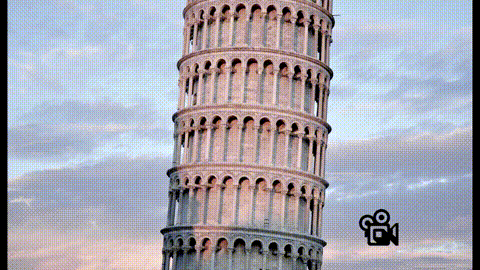
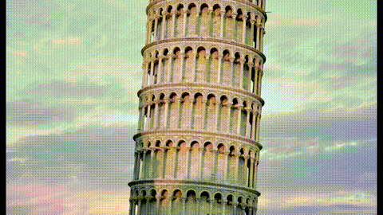

# FFmpeg Video Slideshow Advanced Scripts

Scripts in this section demonstrate enhanced animations.

Animations are implemented inside filter_complex blocks.

## Blurred Background

This script removes black areas from sides/top/bottom with blur effect

## Logo Overlay

Logo is overlaid at the right bottom corner of the slideshow

## Moving Text

Text moving from right to left at the bottom of the slideshow

## Object Move

Snow flakes falling

## Photo Collection

This script is enhanced version of 'Rotate' transition. Each photo stops rotating on a specific angle; where some parts of old photos are still visible

## Push Horizontal Film

This script is enhanced version of 'Push Horizontal' transition. A film frame is overlaid to images and static frames are removed to create movie film looking

## Push Vertical Film

Vertical version of 'Push Horizontal Film'

## Sliding Horizontal Bars

Enhanced version of 'Wipe In' transition. Screen is divided into five horizontal bars sliding from left to right in 0.2 second intervals.

## Sliding Vertical Bars

Vertical version of 'Sliding Horizontal Bars'. Screen is divided into five vertical bars sliding from top to bottom in 0.2 second intervals.

## Wipe In Horizontal with Vertical Panning

This script enhances 'Wipe In Horizontal' where photos do not stand in static positions and pan through time from top to bottom.

## Wipe In Vertical with Horizontal Panning

This script enhances 'Wipe In Vertical' where photos do not stand in static positions and pan through time from left to right.

