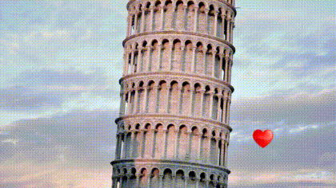
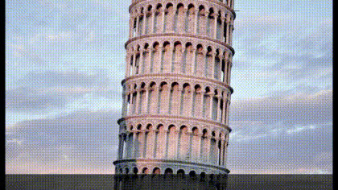
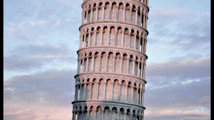

# FFmpeg Video Slideshow Advanced Scripts

Scripts in this section demonstrate complex animation like transitions/transformations. Only images are supported, no video input support.

Please note that sample animations used in this page are low in quality and does not represent full functionality of the scripts.

## Blurred Background

Replaces blank areas from sides/top/bottom with blur effect

**Options:** width, height, fps, image duration, transition duration

#### Scene Arrangement

|  #  |      Scene    |    Duration (seconds)    |
|:---:|:-------------:|:------------------------:|
|  1  | Show Image #1          |      image duration      |
|  2  | Transition to Image #2 |   transition duration    |
|  3  | Show Image #2          |      image duration      |
|  4  | Transition to Image #3 |   transition duration    |
| ... | ...                    |      ...                 |
|  (n-1)*2+1  | Show Image #n  |      image duration      |

## Logo Overlay & Zoom

Overlays a beating heart animation (generated from a static heart image with zoom effect) at the right bottom corner of the slideshow

**Options:** screen mode, width, height, fps, image duration, transition duration, background color, heart frame size, heart frame position

#### Scene Arrangement

|  #  |      Scene    |    Duration (seconds)    |
|:---:|:-------------:|:------------------------:|
|  1  | Show Image #1          |      image duration      |
|  2  | Transition to Image #2 |   transition duration    |
|  3  | Show Image #2          |      image duration      |
|  4  | Transition to Image #3 |   transition duration    |
| ... | ...                    |      ...                 |
|  (n-1)*2+1  | Show Image #n  |      image duration      |

## Moving Text

Moves text from right to the left or from left to the right on a slideshow

**Options:** screen mode, width, height, fps, image duration, transition duration, background color, text, text font, text size, text color, text speed, text position, text frame height, text frame position, direction

#### Scene Arrangement

|  #  |      Scene    |    Duration (seconds)    |
|:---:|:-------------:|:------------------------:|
|  1  | Show Image #1          |      image duration      |
|  2  | Transition to Image #2 |   transition duration    |
|  3  | Show Image #2          |      image duration      |
|  4  | Transition to Image #3 |   transition duration    |
| ... | ...                    |      ...                 |
|  (n-1)*2+1  | Show Image #n  |      image duration      |

## Object Animation

Animates snow flakes falling from random positions and rotating around themselves

**Options:** screen mode, width, height, fps, image duration, transition duration, background color, snow flake size, snow flake rotate speed, snow flake fall speed 

#### Scene Arrangement

|  #  |      Scene    |    Duration (seconds)    |
|:---:|:-------------:|:------------------------:|
|  1  | Show Image #1          |      image duration      |
|  2  | Transition to Image #2 |   transition duration    |
|  3  | Show Image #2          |      image duration      |
|  4  | Transition to Image #3 |   transition duration    |
| ... | ...                    |      ...                 |
|  (n-1)*2+1  | Show Image #n  |      image duration      |

## Photo Collection

Enhanced version of `Rotate` transition. Each image stops rotating on a specific angle where some parts of the previous images are still visible

**Options:** width, height, fps, image duration, transition duration, background color, max image angle 

#### Scene Arrangement

|  #  |      Scene    |    Duration (seconds)    |
|:---:|:-------------:|:------------------------:|
|  1  | Transition to Image #1 |   transition duration    |
|  2  | Show Image #1          |      image duration      |
|  3  | Transition to Image #2 |   transition duration    |
|  4  | Show Image #2          |      image duration      |
| ... | ...                    |      ...                 |
|  n*2  | Show Image #n  |      image duration      |

## Push Film

Enhanced version of `Push` transition. Static parts are removed and a strip frame is used as overlay image to create film strip animation

**Options:** screen mode, width, height, fps, transition duration, background color, direction

#### Scene Arrangement

|  #  |      Scene    |    Duration (seconds)    |
|:---:|:-------------:|:------------------------:|
|  1  | Transition to Image #1 |   transition duration    |
|  2  | Transition to Image #2 |   transition duration    |
|  3  | Transition to Image #3 |   transition duration    |
| ... | ...                    |      ...                 |
|  n  | Transition to Image #n |   transition duration    |
|  n+1  | Outro |   transition duration    |

&nbsp; &nbsp; &nbsp; &nbsp; &nbsp; &nbsp; &nbsp; &nbsp; &nbsp; &nbsp; &nbsp; &nbsp; &nbsp; &nbsp; &nbsp; &nbsp; &nbsp; &nbsp; Horizontal &nbsp; &nbsp; &nbsp; &nbsp; &nbsp; &nbsp; &nbsp; &nbsp; &nbsp; &nbsp; &nbsp; &nbsp; &nbsp; &nbsp; &nbsp; &nbsp; &nbsp; &nbsp; &nbsp; &nbsp; &nbsp; &nbsp; &nbsp; &nbsp; &nbsp; &nbsp; &nbsp; &nbsp; &nbsp; &nbsp; &nbsp; &nbsp; &nbsp; &nbsp; &nbsp; &nbsp; &nbsp; &nbsp; &nbsp; &nbsp; &nbsp; &nbsp; &nbsp; &nbsp; &nbsp; Vertical

  
   

## Zoom & Pan with Fade In/Out Transition #1

Each image focuses on a different area of the image

**Options:** width, height, fps, image duration, transition duration, zoom speed, screen mode, background color

#### Scene Arrangement

<table>
<thead>
<tr>
<th align="center">#</th>
<th align="center">Effect</th>
<th align="center">Scene</th>
<th align="center">Duration (seconds)</th>
</tr>
</thead>
<tbody>
<tr>
<td align="center">1</td>
<td align="center" rowspan="3">Zoom & Pan</td>
<td align="center">Fade in Image #1</td>
<td align="center">transition duration</td>
</tr>
<tr>
<td align="center">2</td>
<td align="center">Show Image #1</td>
<td align="center">image duration</td>
</tr>
<tr>
<td align="center">3</td>
<td align="center">Fade out Image #1</td>
<td align="center">transition duration</td>
</tr>
<tr>
<td align="center">4</td>
<td align="center" rowspan="3">Zoom & Pan</td>
<td align="center">Fade in Image #2</td>
<td align="center">transition duration</td>
</tr>
<tr>
<td align="center">5</td>
<td align="center">Show Image #2</td>
<td align="center">image duration</td>
</tr>
<tr>
<td align="center">6</td>
<td align="center">Fade out Image #2</td>
<td align="center">transition duration</td>
</tr>
<tr>
<td align="center">...</td>
<td align="center"></td>
<td align="center">...</td>
<td align="center">...</td>
</tr>
<tr>
<td align="center">n*3-2</td>
<td align="center" rowspan="3">Zoom & Pan</td>
<td align="center">Fade in Image #n</td>
<td align="center">transition duration</td>
</tr>
<tr>
<td align="center">n*3-1</td>
<td align="center">Show Image #n</td>
<td align="center">image duration</td>
</tr>
<tr>
<td align="center">n*3</td>
<td align="center">Fade out Image #n</td>
<td align="center">transition duration</td>
</tr>
</tbody>
</table>

&nbsp; &nbsp; &nbsp; &nbsp; &nbsp; &nbsp; &nbsp; &nbsp; &nbsp; &nbsp; &nbsp; &nbsp; &nbsp; &nbsp; &nbsp; &nbsp; &nbsp; &nbsp; &nbsp; Zoom In &nbsp; &nbsp; &nbsp; &nbsp; &nbsp; &nbsp; &nbsp; &nbsp; &nbsp; &nbsp; &nbsp; &nbsp; &nbsp; &nbsp; &nbsp; &nbsp; &nbsp; &nbsp; &nbsp; &nbsp; &nbsp; &nbsp; &nbsp; &nbsp; &nbsp; &nbsp; &nbsp; &nbsp; &nbsp; &nbsp; &nbsp; &nbsp; &nbsp; &nbsp; &nbsp; &nbsp; &nbsp; &nbsp; &nbsp; &nbsp; &nbsp; &nbsp; &nbsp; &nbsp; &nbsp; Zoom Out

  
   

## Zoom & Pan with Fade In/Out Transition #2

Each image focuses on a different area of the image

**Options:** width, height, fps, image duration, transition duration, screen mode, background color

#### Scene Arrangement

|  #  |     Effect    |    Scene      |    Duration (seconds)    |
|:---:|:-------------:|:-------------:|:------------------------:|
|  1  |  Zoom & Pan  |  Fade in Image #1  |      transition duration      |
|  2  |  -  | Show Image #1          |      image duration      |
|  3  |  -  | Fade out Image #1 |   transition duration    |
|  4  |  Zoom & Pan  |  Fade in Image #2  |      transition duration      |
|  5  |  -  | Show Image #2          |      image duration      |
|  6  |  -  | Fade out Image #2 |   transition duration    |
| ... |     |     ...           |      ...                 |
|  n*3-2  |  Zoom & Pan  |  Fade in Image #n  |      transition duration      |
|  n*3-1  |  -  | Show Image #n          |      image duration      |
|  n*3  |  -  | Fade out Image #n |   transition duration    |

&nbsp; &nbsp; &nbsp; &nbsp; &nbsp; &nbsp; &nbsp; &nbsp; &nbsp; &nbsp; &nbsp; &nbsp; &nbsp; &nbsp; &nbsp; &nbsp; &nbsp; &nbsp; &nbsp; Zoom In &nbsp; &nbsp; &nbsp; &nbsp; &nbsp; &nbsp; &nbsp; &nbsp; &nbsp; &nbsp; &nbsp; &nbsp; &nbsp; &nbsp; &nbsp; &nbsp; &nbsp; &nbsp; &nbsp; &nbsp; &nbsp; &nbsp; &nbsp; &nbsp; &nbsp; &nbsp; &nbsp; &nbsp; &nbsp; &nbsp; &nbsp; &nbsp; &nbsp; &nbsp; &nbsp; &nbsp; &nbsp; &nbsp; &nbsp; &nbsp; &nbsp; &nbsp; &nbsp; &nbsp; &nbsp; Zoom Out

  
   

