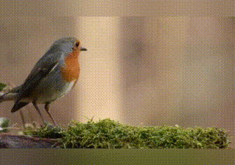

# Advanced Scripts with Video Support

You can get Advanced Scripts with Video Support by buying me a coffee from .

Scripts in this section demonstrate complex animation like transitions/transformations.

Both images and videos (with or without audio) are supported as input.

Please note that sample animations used in this page are low in quality and does not represent full functionality of the scripts.

## Blurred Background

Blurs blank areas from sides/top/bottom

**Options:** width, height, fps, image duration, transition duration, audio sample format, audio sample rate, audio channel layout

#### Scene Arrangement

|  #  |      Scene    |    Duration (seconds)    |
|:---:|:-------------:|:------------------------:|
|  1  | Show file #1          |      image/video duration - transition duration    |
|  2  | Transition to file #2 |   transition duration    |
|  3  | Show file #2          |      image/video duration - 2*transition duration    |
|  4  | Transition to file #3 |   transition duration    |
| ... | ...                    |      ...                 |  
|  (n-1)*2+1  | Show file #n  |      image/video duration - transition duration    |

## Logo Overlay & Zoom

Overlays a beating heart animation (generated from a static heart image with zoom effect) at the right bottom corner of the slideshow

**Options:** screen mode, width, height, fps, image duration, transition duration, background color, heart frame size, heart frame position, audio sample format, audio sample rate, audio channel layout

#### Scene Arrangement

|  #  |      Scene    |    Duration (seconds)    |
|:---:|:-------------:|:------------------------:|
|  1  | Show file #1          |      image/video duration - transition duration    |
|  2  | Transition to file #2 |   transition duration    |
|  3  | Show file #2          |      image/video duration - 2*transition duration    |
|  4  | Transition to file #3 |   transition duration    |
| ... | ...                    |      ...                 |  
|  (n-1)*2+1  | Show file #n  |      image/video duration - transition duration    |

## Moving Text

Moves text from right to the left or from left to the right on a slideshow

**Options:** screen mode, width, height, fps, image duration, transition duration, background color, text, text font, text size, text color, text speed, text position, text frame height, text frame position, direction, audio sample format, audio sample rate, audio channel layout

#### Scene Arrangement

|  #  |      Scene    |    Duration (seconds)    |
|:---:|:-------------:|:------------------------:|
|  1  | Show file #1          |      image/video duration - transition duration    |
|  2  | Transition to file #2 |   transition duration    |
|  3  | Show file #2          |      image/video duration - 2*transition duration    |
|  4  | Transition to file #3 |   transition duration    |
| ... | ...                    |      ...                 |  
|  (n-1)*2+1  | Show file #n  |      image/video duration - transition duration    |

## Object Animation

Animates falling and rotating snow flakes

**Options:** screen mode, width, height, fps, image duration, transition duration, background color, snow flake size, snow flake rotate speed, snow flake fall speed, audio sample format, audio sample rate, audio channel layout 

#### Scene Arrangement

|  #  |      Scene    |    Duration (seconds)    |
|:---:|:-------------:|:------------------------:|
|  1  | Show file #1          |      image/video duration - transition duration    |
|  2  | Transition to file #2 |   transition duration    |
|  3  | Show file #2          |      image/video duration - 2*transition duration    |
|  4  | Transition to file #3 |   transition duration    |
| ... | ...                    |      ...                 |  
|  (n-1)*2+1  | Show file #n  |      image/video duration - transition duration    |

## Zoom & Pan with Fade In/Out Transition #1

Zooms in/out on a specific part of the image/video

**Options:** width, height, fps, image duration, transition duration, zoom speed, screen mode, background color, audio sample format, audio sample rate, audio channel layout

#### Scene Arrangement

<table>
<thead>
<tr>
<th align="center">#</th>
<th align="center">Effect</th>
<th align="center">Scene</th>
<th align="center">Duration (seconds)</th>
</tr>
</thead>
<tbody>
<tr>
<td align="center">1</td>
<td align="center" rowspan="3">Zoom & Pan</td>
<td align="center">Fade in Image #1</td>
<td align="center">transition duration</td>
</tr>
<tr>
<td align="center">2</td>
<td align="center">Show Image #1</td>
<td align="center">image/video duration - 2*transition duration</td>
</tr>
<tr>
<td align="center">3</td>
<td align="center">Fade out Image #1</td>
<td align="center">transition duration</td>
</tr>
<tr>
<td align="center">4</td>
<td align="center" rowspan="3">Zoom & Pan</td>
<td align="center">Fade in Image #2</td>
<td align="center">transition duration</td>
</tr>
<tr>
<td align="center">5</td>
<td align="center">Show Image #2</td>
<td align="center">image/video duration - 2*transition duration</td>
</tr>
<tr>
<td align="center">6</td>
<td align="center">Fade out Image #2</td>
<td align="center">transition duration</td>
</tr>
<tr>
<td align="center">...</td>
<td align="center"></td>
<td align="center">...</td>
<td align="center">...</td>
</tr>
<tr>
<td align="center">n*3-2</td>
<td align="center" rowspan="3">Zoom & Pan</td>
<td align="center">Fade in Image #n</td>
<td align="center">transition duration</td>
</tr>
<tr>
<td align="center">n*3-1</td>
<td align="center">Show Image #n</td>
<td align="center">image/video duration - 2*transition duration</td>
</tr>
<tr>
<td align="center">n*3</td>
<td align="center">Fade out Image #n</td>
<td align="center">transition duration</td>
</tr>
</tbody>
</table>

&nbsp; &nbsp; &nbsp; &nbsp; &nbsp; &nbsp; &nbsp; &nbsp; &nbsp; &nbsp; &nbsp; &nbsp; &nbsp; &nbsp; &nbsp; &nbsp; &nbsp; &nbsp; &nbsp; Zoom In &nbsp; &nbsp; &nbsp; &nbsp; &nbsp; &nbsp; &nbsp; &nbsp; &nbsp; &nbsp; &nbsp; &nbsp; &nbsp; &nbsp; &nbsp; &nbsp; &nbsp; &nbsp; &nbsp; &nbsp; &nbsp; &nbsp; &nbsp; &nbsp; &nbsp; &nbsp; &nbsp; &nbsp; &nbsp; &nbsp; &nbsp; &nbsp; &nbsp; &nbsp; &nbsp; &nbsp; &nbsp; &nbsp; &nbsp; &nbsp; &nbsp; &nbsp; &nbsp; &nbsp; &nbsp; Zoom Out

  
   

## Zoom & Pan with Fade In/Out Transition #2

Zooms in/out on a specific part of the image/video

**Options:** width, height, fps, image duration, transition duration, screen mode, background color, audio sample format, audio sample rate, audio channel layout

#### Scene Arrangement

|  #  |     Effect    |    Scene      |    Duration (seconds)    |
|:---:|:-------------:|:-------------:|:------------------------:|
|  1  |  Zoom & Pan  |  Fade in Image #1  |      transition duration      |
|  2  |  -  | Show Image #1          |      image/video duration - 2*transition duration      |
|  3  |  -  | Fade out Image #1 |   transition duration    |
|  4  |  Zoom & Pan  |  Fade in Image #2  |      transition duration      |
|  5  |  -  | Show Image #2          |      image/video duration - 2*transition duration      |
|  6  |  -  | Fade out Image #2 |   transition duration    |
| ... |     |     ...           |      ...                 |
|  n*3-2  |  Zoom & Pan  |  Fade in Image #n  |      transition duration      |
|  n*3-1  |  -  | Show Image #n          |      image/video duration - 2*transition duration      |
|  n*3  |  -  | Fade out Image #n |   transition duration    |

&nbsp; &nbsp; &nbsp; &nbsp; &nbsp; &nbsp; &nbsp; &nbsp; &nbsp; &nbsp; &nbsp; &nbsp; &nbsp; &nbsp; &nbsp; &nbsp; &nbsp; &nbsp; &nbsp; Zoom In &nbsp; &nbsp; &nbsp; &nbsp; &nbsp; &nbsp; &nbsp; &nbsp; &nbsp; &nbsp; &nbsp; &nbsp; &nbsp; &nbsp; &nbsp; &nbsp; &nbsp; &nbsp; &nbsp; &nbsp; &nbsp; &nbsp; &nbsp; &nbsp; &nbsp; &nbsp; &nbsp; &nbsp; &nbsp; &nbsp; &nbsp; &nbsp; &nbsp; &nbsp; &nbsp; &nbsp; &nbsp; &nbsp; &nbsp; &nbsp; &nbsp; &nbsp; &nbsp; &nbsp; &nbsp; Zoom Out

  
   

