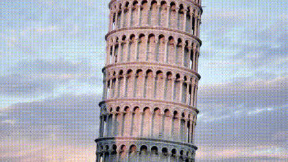

# FFmpeg Video Slideshow Transition Scripts

Each script in this section demonstrates a different transition animation. Only images are supported, no video input support.

Please note that sample animations used in this page are low in quality and does not represent full functionality of the scripts.

## Bars #1

New image appears through growing bars, bars grow from one side to the other side

**Options:** screen mode, width, height, fps, image duration, transition duration, background color, bar count

#### Scene Arrangement

|  #  |      Scene    |    Duration (seconds)    |
|:---:|:-------------:|:------------------------:|
|  1  | Show Image #1          |      image duration      |
|  2  | Transition to Image #2 |   transition duration    |
|  3  | Show Image #2          |      image duration      |
|  4  | Transition to Image #3 |   transition duration    |
| ... | ...                    |      ...                 |
|  (n-1)*2+1  | Show Image #n  |      image duration      |

&nbsp; &nbsp; &nbsp; &nbsp; &nbsp; &nbsp; &nbsp; &nbsp; &nbsp; &nbsp; &nbsp; &nbsp; &nbsp; &nbsp; &nbsp; &nbsp; &nbsp; &nbsp; Horizontal &nbsp; &nbsp; &nbsp; &nbsp; &nbsp; &nbsp; &nbsp; &nbsp; &nbsp; &nbsp; &nbsp; &nbsp; &nbsp; &nbsp; &nbsp; &nbsp; &nbsp; &nbsp; &nbsp; &nbsp; &nbsp; &nbsp; &nbsp; &nbsp; &nbsp; &nbsp; &nbsp; &nbsp; &nbsp; &nbsp; &nbsp; &nbsp; &nbsp; &nbsp; &nbsp; &nbsp; &nbsp; &nbsp; &nbsp; &nbsp; &nbsp; &nbsp; &nbsp; &nbsp; &nbsp; Vertical

  
   

## Bars #2

New image appears through growing bars, bars grow from center to the both sides

**Options:** screen mode, width, height, fps, image duration, transition duration, background color, bar count

#### Scene Arrangement

|  #  |      Scene    |    Duration (seconds)    |
|:---:|:-------------:|:------------------------:|
|  1  | Show Image #1          |      image duration      |
|  2  | Transition to Image #2 |   transition duration    |
|  3  | Show Image #2          |      image duration      |
|  4  | Transition to Image #3 |   transition duration    |
| ... | ...                    |      ...                 |
|  (n-1)*2+1  | Show Image #n  |      image duration      |

&nbsp; &nbsp; &nbsp; &nbsp; &nbsp; &nbsp; &nbsp; &nbsp; &nbsp; &nbsp; &nbsp; &nbsp; &nbsp; &nbsp; &nbsp; &nbsp; &nbsp; &nbsp; Horizontal &nbsp; &nbsp; &nbsp; &nbsp; &nbsp; &nbsp; &nbsp; &nbsp; &nbsp; &nbsp; &nbsp; &nbsp; &nbsp; &nbsp; &nbsp; &nbsp; &nbsp; &nbsp; &nbsp; &nbsp; &nbsp; &nbsp; &nbsp; &nbsp; &nbsp; &nbsp; &nbsp; &nbsp; &nbsp; &nbsp; &nbsp; &nbsp; &nbsp; &nbsp; &nbsp; &nbsp; &nbsp; &nbsp; &nbsp; &nbsp; &nbsp; &nbsp; &nbsp; &nbsp; &nbsp; Vertical

  
   

## Box In

New image appears as a box moving in and out

**Options:** screen mode, width, height, fps, image duration, transition duration, background color, direction

#### Scene Arrangement

|  #  |      Scene    |    Duration (seconds)    |
|:---:|:-------------:|:------------------------:|
|  1  | Box in Image #1 |   transition duration    |
|  2  | Show Image #1          |      image duration      |
|  3  | Box out Image #1 |   transition duration    |
|  4  | Box in Image #2 |   transition duration    |
|  5  | Show Image #2          |      image duration      |
|  6  | Box out Image #2 |   transition duration    |
| ... | ...                    |      ...                 |
|  n*3-2  | Box in Image #n |   transition duration    |
|  n*3-1  | Show Image #n  |      image duration      |
|  n*3  | Box out Image #n |   transition duration    |

&nbsp; &nbsp; &nbsp; &nbsp; &nbsp; &nbsp; &nbsp; &nbsp; &nbsp; &nbsp; &nbsp; &nbsp; &nbsp; &nbsp; &nbsp; &nbsp; &nbsp; &nbsp; Horizontal &nbsp; &nbsp; &nbsp; &nbsp; &nbsp; &nbsp; &nbsp; &nbsp; &nbsp; &nbsp; &nbsp; &nbsp; &nbsp; &nbsp; &nbsp; &nbsp; &nbsp; &nbsp; &nbsp; &nbsp; &nbsp; &nbsp; &nbsp; &nbsp; &nbsp; &nbsp; &nbsp; &nbsp; &nbsp; &nbsp; &nbsp; &nbsp; &nbsp; &nbsp; &nbsp; &nbsp; &nbsp; &nbsp; &nbsp; &nbsp; &nbsp; &nbsp; &nbsp; &nbsp; &nbsp; Vertical

  
   

## Checkerboard

New image appears in growing square boxes

**Options:** screen mode, width, height, fps, image duration, transition duration, background color, cell size

#### Scene Arrangement

|  #  |      Scene    |    Duration (seconds)    |
|:---:|:-------------:|:------------------------:|
|  1  | Show Image #1          |      image duration      |
|  2  | Transition to Image #2 |   transition duration    |
|  3  | Show Image #2          |      image duration      |
|  4  | Transition to Image #3 |   transition duration    |
| ... | ...                    |      ...                 |
|  (n-1)*2+1  | Show Image #n  |      image duration      |

## Clock

New image is revealed by a clock like line swiping across the screen

**Options:** screen mode, width, height, fps, image duration, background color

#### Scene Arrangement

|  #  |      Scene    |    Duration (seconds)    |
|:---:|:-------------:|:------------------------:|
|  1  | Show Image #1          |      image duration      |
|  2  | Transition to Image #2 |   transition duration    |
|  3  | Show Image #2          |      image duration      |
|  4  | Transition to Image #3 |   transition duration    |
| ... | ...                    |      ...                 |
|  (n-1)*2+1  | Show Image #n  |      image duration      |

## Collapse

New image appears as two lines move from sides to center

**Options:** screen mode, width, height, fps, image duration, transition duration, background color

#### Scene Arrangement

|  #  |      Scene    |    Duration (seconds)    |
|:---:|:-------------:|:------------------------:|
|  1  | Show Image #1          |      image duration      |
|  2  | Transition to Image #2 |   transition duration    |
|  3  | Show Image #2          |      image duration      |
|  4  | Transition to Image #3 |   transition duration    |
| ... | ...                    |      ...                 |
|  (n-1)*2+1  | Show Image #n  |      image duration      |

&nbsp; &nbsp; &nbsp; &nbsp; &nbsp; &nbsp; &nbsp; &nbsp; &nbsp; &nbsp; &nbsp; &nbsp; &nbsp; &nbsp; &nbsp; &nbsp; &nbsp; &nbsp; Horizontal &nbsp; &nbsp; &nbsp; &nbsp; &nbsp; &nbsp; &nbsp; &nbsp; &nbsp; &nbsp; &nbsp; &nbsp; &nbsp; &nbsp; &nbsp; &nbsp; &nbsp; &nbsp; &nbsp; &nbsp; &nbsp; &nbsp; &nbsp; &nbsp; &nbsp; &nbsp; &nbsp; &nbsp; &nbsp; &nbsp; &nbsp; &nbsp; &nbsp; &nbsp; &nbsp; &nbsp; &nbsp; &nbsp; &nbsp; &nbsp; &nbsp; &nbsp; &nbsp; &nbsp; &nbsp; Vertical

  
   

## Collapse Both

Horizontal and vertical collapse at the same time

**Options:** screen mode, width, height, fps, image duration, transition duration, background color

#### Scene Arrangement

|  #  |      Scene    |    Duration (seconds)    |
|:---:|:-------------:|:------------------------:|
|  1  | Show Image #1          |      image duration      |
|  2  | Transition to Image #2 |   transition duration    |
|  3  | Show Image #2          |      image duration      |
|  4  | Transition to Image #3 |   transition duration    |
| ... | ...                    |      ...                 |
|  (n-1)*2+1  | Show Image #n  |      image duration      |

## Collapse Circular

Circular collapse

**Options:** screen mode, width, height, fps, image duration, transition duration, background color

#### Scene Arrangement

|  #  |      Scene    |    Duration (seconds)    |
|:---:|:-------------:|:------------------------:|
|  1  | Show Image #1          |      image duration      |
|  2  | Transition to Image #2 |   transition duration    |
|  3  | Show Image #2          |      image duration      |
|  4  | Transition to Image #3 |   transition duration    |
| ... | ...                    |      ...                 |
|  (n-1)*2+1  | Show Image #n  |      image duration      |

## Cover

A line moving shows the new image

**Options:** screen mode, width, height, fps, image duration, transition duration, background color, direction

#### Scene Arrangement

|  #  |      Scene    |    Duration (seconds)    |
|:---:|:-------------:|:------------------------:|
|  1  | Show Image #1          |      image duration      |
|  2  | Transition to Image #2 |   transition duration    |
|  3  | Show Image #2          |      image duration      |
|  4  | Transition to Image #3 |   transition duration    |
| ... | ...                    |      ...                 |
|  (n-1)*2+1  | Show Image #n  |      image duration      |

&nbsp; &nbsp; &nbsp; &nbsp; &nbsp; &nbsp; &nbsp; &nbsp; &nbsp; &nbsp; &nbsp; &nbsp; &nbsp; &nbsp; &nbsp; &nbsp; &nbsp; &nbsp; Horizontal &nbsp; &nbsp; &nbsp; &nbsp; &nbsp; &nbsp; &nbsp; &nbsp; &nbsp; &nbsp; &nbsp; &nbsp; &nbsp; &nbsp; &nbsp; &nbsp; &nbsp; &nbsp; &nbsp; &nbsp; &nbsp; &nbsp; &nbsp; &nbsp; &nbsp; &nbsp; &nbsp; &nbsp; &nbsp; &nbsp; &nbsp; &nbsp; &nbsp; &nbsp; &nbsp; &nbsp; &nbsp; &nbsp; &nbsp; &nbsp; &nbsp; &nbsp; &nbsp; &nbsp; &nbsp; Vertical

  
   

## Expand

New image appears as two lines move from center to sides

**Options:** screen mode, width, height, fps, image duration, transition duration, background color

#### Scene Arrangement

|  #  |      Scene    |    Duration (seconds)    |
|:---:|:-------------:|:------------------------:|
|  1  | Show Image #1          |      image duration      |
|  2  | Transition to Image #2 |   transition duration    |
|  3  | Show Image #2          |      image duration      |
|  4  | Transition to Image #3 |   transition duration    |
| ... | ...                    |      ...                 |
|  (n-1)*2+1  | Show Image #n  |      image duration      |

&nbsp; &nbsp; &nbsp; &nbsp; &nbsp; &nbsp; &nbsp; &nbsp; &nbsp; &nbsp; &nbsp; &nbsp; &nbsp; &nbsp; &nbsp; &nbsp; &nbsp; &nbsp; Horizontal &nbsp; &nbsp; &nbsp; &nbsp; &nbsp; &nbsp; &nbsp; &nbsp; &nbsp; &nbsp; &nbsp; &nbsp; &nbsp; &nbsp; &nbsp; &nbsp; &nbsp; &nbsp; &nbsp; &nbsp; &nbsp; &nbsp; &nbsp; &nbsp; &nbsp; &nbsp; &nbsp; &nbsp; &nbsp; &nbsp; &nbsp; &nbsp; &nbsp; &nbsp; &nbsp; &nbsp; &nbsp; &nbsp; &nbsp; &nbsp; &nbsp; &nbsp; &nbsp; &nbsp; &nbsp; Vertical

  
   

## Expand Both

Horizontal and vertical expand at the same time

**Options:** screen mode, width, height, fps, image duration, transition duration, background color

#### Scene Arrangement

|  #  |      Scene    |    Duration (seconds)    |
|:---:|:-------------:|:------------------------:|
|  1  | Show Image #1          |      image duration      |
|  2  | Transition to Image #2 |   transition duration    |
|  3  | Show Image #2          |      image duration      |
|  4  | Transition to Image #3 |   transition duration    |
| ... | ...                    |      ...                 |
|  (n-1)*2+1  | Show Image #n  |      image duration      |

## Expand Circular

Circular expand

**Options:** screen mode, width, height, fps, image duration, transition duration, background color

#### Scene Arrangement

|  #  |      Scene    |    Duration (seconds)    |
|:---:|:-------------:|:------------------------:|
|  1  | Show Image #1          |      image duration      |
|  2  | Transition to Image #2 |   transition duration    |
|  3  | Show Image #2          |      image duration      |
|  4  | Transition to Image #3 |   transition duration    |
| ... | ...                    |      ...                 |
|  (n-1)*2+1  | Show Image #n  |      image duration      |

## Fade In #1

New image appears fading in

**Options:** screen mode, width, height, fps, image duration, transition duration, background color

#### Scene Arrangement

|  #  |      Scene    |    Duration (seconds)    |
|:---:|:-------------:|:------------------------:|
|  1  | Show Image #1          |      image duration      |
|  2  | Transition to Image #2 |   transition duration    |
|  3  | Show Image #2          |      image duration      |
|  4  | Transition to Image #3 |   transition duration    |
| ... | ...                    |      ...                 |
|  (n-1)*2+1  | Show Image #n  |      image duration      |

## Fade In #2

New image appears fading in while the previous one is fading out

**Options:** screen mode, width, height, fps, image duration, transition duration, background color

#### Scene Arrangement

|  #  |      Scene    |    Duration (seconds)    |
|:---:|:-------------:|:------------------------:|
|  1  | Show Image #1          |      image duration      |
|  2  | Transition to Image #2 |   transition duration    |
|  3  | Show Image #2          |      image duration      |
|  4  | Transition to Image #3 |   transition duration    |
| ... | ...                    |      ...                 |
|  (n-1)*2+1  | Show Image #n  |      image duration      |

## Push

New image pushes previous image

**Options:** screen mode, width, height, fps, image duration, transition duration, background color, direction

#### Scene Arrangement

|  #  |      Scene    |    Duration (seconds)    |
|:---:|:-------------:|:------------------------:|
|  1  | Show Image #1          |      image duration      |
|  2  | Transition to Image #2 |   transition duration    |
|  3  | Show Image #2          |      image duration      |
|  4  | Transition to Image #3 |   transition duration    |
| ... | ...                    |      ...                 |
|  (n-1)*2+1  | Show Image #n  |      image duration      |

&nbsp; &nbsp; &nbsp; &nbsp; &nbsp; &nbsp; &nbsp; &nbsp; &nbsp; &nbsp; &nbsp; &nbsp; &nbsp; &nbsp; &nbsp; &nbsp; &nbsp; &nbsp; Horizontal &nbsp; &nbsp; &nbsp; &nbsp; &nbsp; &nbsp; &nbsp; &nbsp; &nbsp; &nbsp; &nbsp; &nbsp; &nbsp; &nbsp; &nbsp; &nbsp; &nbsp; &nbsp; &nbsp; &nbsp; &nbsp; &nbsp; &nbsp; &nbsp; &nbsp; &nbsp; &nbsp; &nbsp; &nbsp; &nbsp; &nbsp; &nbsp; &nbsp; &nbsp; &nbsp; &nbsp; &nbsp; &nbsp; &nbsp; &nbsp; &nbsp; &nbsp; &nbsp; &nbsp; &nbsp; Vertical

  
   

## Push Box

`Box In` and `Push` transitions combined.

**Options:** screen mode, width, height, fps, image duration, transition duration, background color, direction

#### Scene Arrangement

|  #  |      Scene    |    Duration (seconds)    |
|:---:|:-------------:|:------------------------:|
|  1  | Box in Image #1 |   transition duration    |
|  2  | Show Image #1          |      image duration      |
|  3  | Box out Image #1 |   transition duration    |
|  4  | Box in Image #2 |   transition duration    |
|  5  | Show Image #2          |      image duration      |
|  6  | Box out Image #2 |   transition duration    |
| ... | ...                    |      ...                 |
|  n*3-2  | Box in Image #n |   transition duration    |
|  n*3-1  | Show Image #n  |      image duration      |
|  n*3  | Box out Image #n |   transition duration    |

&nbsp; &nbsp; &nbsp; &nbsp; &nbsp; &nbsp; &nbsp; &nbsp; &nbsp; &nbsp; &nbsp; &nbsp; &nbsp; &nbsp; &nbsp; &nbsp; &nbsp; &nbsp; Horizontal &nbsp; &nbsp; &nbsp; &nbsp; &nbsp; &nbsp; &nbsp; &nbsp; &nbsp; &nbsp; &nbsp; &nbsp; &nbsp; &nbsp; &nbsp; &nbsp; &nbsp; &nbsp; &nbsp; &nbsp; &nbsp; &nbsp; &nbsp; &nbsp; &nbsp; &nbsp; &nbsp; &nbsp; &nbsp; &nbsp; &nbsp; &nbsp; &nbsp; &nbsp; &nbsp; &nbsp; &nbsp; &nbsp; &nbsp; &nbsp; &nbsp; &nbsp; &nbsp; &nbsp; &nbsp; Vertical

  
   

## Rotate

New image appears moving from left to right and rotating

**Options:** width, height, fps, image duration, transition duration, screen mode, background color

#### Scene Arrangement

|  #  |      Scene    |    Duration (seconds)    |
|:---:|:-------------:|:------------------------:|
|  1  | Transition to Image #1 |   transition duration    |
|  2  | Show Image #1          |      image duration      |
|  3  | Transition to Image #2 |   transition duration    |
|  4  | Show Image #2          |      image duration      |
| ... | ...                    |      ...                 |
|  n*2  | Show Image #n  |      image duration      |

## Sliding Bars

Enhanced version of `Wipe In` transition. Screen is divided into bars sliding from one side to another

**Options:** screen mode, width, height, fps, image duration, transition duration, background color, bar count, direction

#### Scene Arrangement

|  #  |      Scene    |    Duration (seconds)    |
|:---:|:-------------:|:------------------------:|
|  1  | Show Image #1          |      image duration      |
|  2  | Transition to Image #2 |   transition duration    |
|  3  | Show Image #2          |      image duration      |
|  4  | Transition to Image #3 |   transition duration    |
| ... | ...                    |      ...                 |
|  (n-1)*2+1  | Show Image #n  |      image duration      |

&nbsp; &nbsp; &nbsp; &nbsp; &nbsp; &nbsp; &nbsp; &nbsp; &nbsp; &nbsp; &nbsp; &nbsp; &nbsp; &nbsp; &nbsp; &nbsp; &nbsp; &nbsp; Horizontal &nbsp; &nbsp; &nbsp; &nbsp; &nbsp; &nbsp; &nbsp; &nbsp; &nbsp; &nbsp; &nbsp; &nbsp; &nbsp; &nbsp; &nbsp; &nbsp; &nbsp; &nbsp; &nbsp; &nbsp; &nbsp; &nbsp; &nbsp; &nbsp; &nbsp; &nbsp; &nbsp; &nbsp; &nbsp; &nbsp; &nbsp; &nbsp; &nbsp; &nbsp; &nbsp; &nbsp; &nbsp; &nbsp; &nbsp; &nbsp; &nbsp; &nbsp; &nbsp; &nbsp; &nbsp; Vertical

  
   

## Spin Blur Rotation

New image appears with spin blur rotation effect

**Options:** width, height, fps, image duration

#### Scene Arrangement

|  #  |      Scene    |    Duration (seconds)    |
|:---:|:-------------:|:------------------------:|
|  1  | Show Image #1          |  image duration      |
|  2  | Transition to Image #2 |     0.5    |
|  3  | Show Image #2          |  image duration      |
|  4  | Transition to Image #3 |     0.5    |
| ... | ...                    |      ...             |
|  (n-1)*2+1  | Show Image #n  |  image duration      |

## Stack

Scrolls the images horizontally or vertically

**Options:** width, height, fps, total duration, background color, direction, include intro, include outro  

#### Scene Arrangement

|  #  |      Scene    |    Duration (seconds)    |
|:---:|:-------------:|:------------------------:|
|  1  | Transition to Image #1 |   total duration/image count    |
|  2  | Transition to Image #2 |   total duration/image count    |
|  3  | Transition to Image #3 |   total duration/image count    |
| ... | ...                    |      ...                 |
|  n  | Transition to Image #n |   total duration/image count    |

&nbsp; &nbsp; &nbsp; &nbsp; &nbsp; &nbsp; &nbsp; &nbsp; &nbsp; &nbsp; &nbsp; &nbsp; &nbsp; &nbsp; &nbsp; &nbsp; &nbsp; &nbsp; Horizontal &nbsp; &nbsp; &nbsp; &nbsp; &nbsp; &nbsp; &nbsp; &nbsp; &nbsp; &nbsp; &nbsp; &nbsp; &nbsp; &nbsp; &nbsp; &nbsp; &nbsp; &nbsp; &nbsp; &nbsp; &nbsp; &nbsp; &nbsp; &nbsp; &nbsp; &nbsp; &nbsp; &nbsp; &nbsp; &nbsp; &nbsp; &nbsp; &nbsp; &nbsp; &nbsp; &nbsp; &nbsp; &nbsp; &nbsp; &nbsp; &nbsp; &nbsp; &nbsp; &nbsp; &nbsp; Vertical

  
   

## Wipe In

New image appears moving in

**Options:** screen mode, width, height, fps, image duration, transition duration, background color, direction

#### Scene Arrangement

|  #  |      Scene    |    Duration (seconds)    |
|:---:|:-------------:|:------------------------:|
|  1  | Show Image #1          |      image duration      |
|  2  | Transition to Image #2 |   transition duration    |
|  3  | Show Image #2          |      image duration      |
|  4  | Transition to Image #3 |   transition duration    |
| ... | ...                    |      ...                 |
|  (n-1)*2+1  | Show Image #n  |      image duration      |

&nbsp; &nbsp; &nbsp; &nbsp; &nbsp; &nbsp; &nbsp; &nbsp; &nbsp; &nbsp; &nbsp; &nbsp; &nbsp; &nbsp; &nbsp; &nbsp; &nbsp; &nbsp; Horizontal &nbsp; &nbsp; &nbsp; &nbsp; &nbsp; &nbsp; &nbsp; &nbsp; &nbsp; &nbsp; &nbsp; &nbsp; &nbsp; &nbsp; &nbsp; &nbsp; &nbsp; &nbsp; &nbsp; &nbsp; &nbsp; &nbsp; &nbsp; &nbsp; &nbsp; &nbsp; &nbsp; &nbsp; &nbsp; &nbsp; &nbsp; &nbsp; &nbsp; &nbsp; &nbsp; &nbsp; &nbsp; &nbsp; &nbsp; &nbsp; &nbsp; &nbsp; &nbsp; &nbsp; &nbsp; Vertical

  
   

## Wipe Out

New image disappears moving out

**Options:** screen mode, width, height, fps, image duration, transition duration, background color, direction

#### Scene Arrangement

|  #  |      Scene    |    Duration (seconds)    |
|:---:|:-------------:|:------------------------:|
|  1  | Show Image #1          |      image duration      |
|  2  | Transition to Image #2 |   transition duration    |
|  3  | Show Image #2          |      image duration      |
|  4  | Transition to Image #3 |   transition duration    |
| ... | ...                    |      ...                 |
|  (n-1)*2+1  | Show Image #n  |      image duration      |

&nbsp; &nbsp; &nbsp; &nbsp; &nbsp; &nbsp; &nbsp; &nbsp; &nbsp; &nbsp; &nbsp; &nbsp; &nbsp; &nbsp; &nbsp; &nbsp; &nbsp; &nbsp; Horizontal &nbsp; &nbsp; &nbsp; &nbsp; &nbsp; &nbsp; &nbsp; &nbsp; &nbsp; &nbsp; &nbsp; &nbsp; &nbsp; &nbsp; &nbsp; &nbsp; &nbsp; &nbsp; &nbsp; &nbsp; &nbsp; &nbsp; &nbsp; &nbsp; &nbsp; &nbsp; &nbsp; &nbsp; &nbsp; &nbsp; &nbsp; &nbsp; &nbsp; &nbsp; &nbsp; &nbsp; &nbsp; &nbsp; &nbsp; &nbsp; &nbsp; &nbsp; &nbsp; &nbsp; &nbsp; Vertical

  
   

