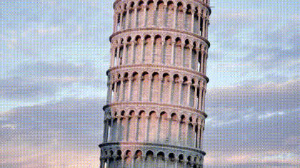
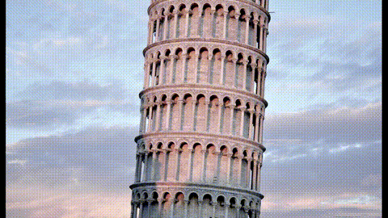
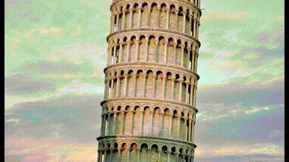

# FFmpeg Video Slideshow Transition Scripts

Each script in this section demonstrates a different transition animation.

Transitions are implemented as custom filters in the following execution order.

1. Prepare input streams
2. Generate static frames
3. Generate transition frames
4. Concat static and transition streams

## Bars #1 (Horizontal)

New photo appears through growing horizontal bars, bars grow from top to bottom

## Bars #2 (Horizontal)

New photo appears through growing horizontal bars, bars grow from center to vertical sides

## Bars # 1 (Vertical)

New photo appears through growing vertical bars, bars grow from left to right

## Bars # 2 (Vertical)

New photo appears through growing vertical bars, bars grow from center to horizontal sides

## Checkerboard

New photo appears in growing 128x128 px boxes

## Collapse Horizontal

New photo appears as two vertical lines move horizontally from sides to center

## Collapse Vertical

New photo appears as two horizontal lines move vertically from top and bottom to center

## Collapse Both

Horizontal and vertical collapse at the same time

## Cover Horizontal

A vertical line moving from left to right shows new photo

## Cover Vertical

A horizontal line moving from top to bottom shows new photo

## Expand Horizontal

New photo appears as two vertical lines move horizontally from center to left and right

## Expand Vertical

New photo appears as two horizontal lines move vertically from center to top and bottom  

## Expand Both

Horizontal and vertical expand at the same time

## Fade In #1

New photo appears fading in

## Fade In #2

New photo appears fading in while the old one is fading out

## Push Horizontal

New photo pushes old photo from left to right

## Push Vertical

New photo pushes old photo from top to bottom

## Rotate

New photo appears moving from left to right and rotating

## Wipe In Horizontal

New photo appears moving from left to right

## Wipe In Vertical

New photo appears moving from top to bottom

## Wipe Out Horizontal

New photo disappears moving from left to right

## Wipe Out Vertical

New photo disappears moving from top to bottom

